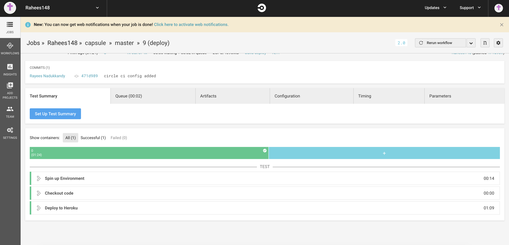

# Capsule Project

## To Start the App

To run the application do the following steps:
```
git clone 'https://github.com/Rahees148/capsule.git'
npm install
npm run start
```
DEMO : https://capsule-cicd.herokuapp.com/

## Scope of the Project

Following functionalities are implemented
* Give a chat Interface to user
* User can talk with all members in default group
* User can create public/private teams
* User can add differnt users into the teams
* User can see their friends list
* User can see the members of the team which he is authorized
* User can chat with team which he is authorzed
* CICD 

